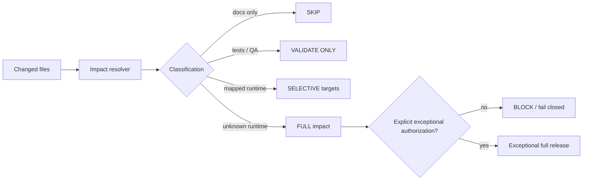

# Architecture

## Invariants

1. Validation does not imply deployment.
2. Documentation-only changes do not publish runtime.
3. Shared runtime contracts may expand to multiple explicit dependents.
4. Unknown runtime impact never silently degrades to “deploy all”.
5. Full-impact execution requires a separate explicit authorization signal.
6. The resolver returns evidence explaining how each changed path was classified.
7. Output is deterministic for a given change set and configuration.
